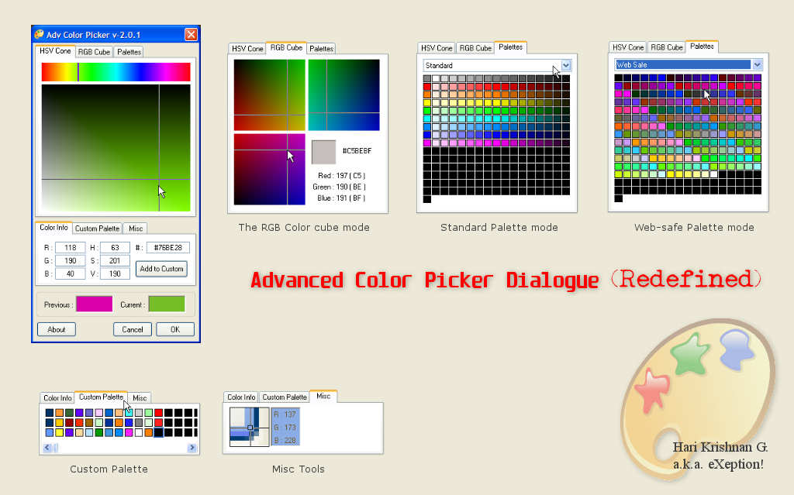



## Most Advanced GDI\+ Color picker control \(\*\*\*ScreenShot\*\*\*\)\)

### Description

The most advanced colour picker user control. See screen shot. A test program also included. Also demonstrates the drawing capability of GDI+.

Easy to use and has tons of features, like RGB,CMY,HSL/HSV colour spaces, pre-defined palettes, custom palettes etc.
 
### More Info
 

             |
---                |---
**Submitted On**   |2005-01-28 20:24:24
**By**             |[Hari Krishnan](https://github.com/Planet-Source-Code/PSCIndex/blob/master/ByAuthor/hari-krishnan.md)
**Level**          |Beginner
**User Rating**    |5.0 (25 globes from 5 users)
**Compatibility**  |VB 5\.0, VB 6\.0
**Category**       |[Graphics](https://github.com/Planet-Source-Code/PSCIndex/blob/master/ByCategory/graphics__1-46.md)
**World**          |[Visual Basic](https://github.com/Planet-Source-Code/PSCIndex/blob/master/ByWorld/visual-basic.md)
**Archive File**   |[Most\_Advan1965121142006\.zip](https://github.com/Planet-Source-Code/hari-krishnan-most-advanced-gdi-color-picker-control-screenshot__1-64033/archive/master.zip)

